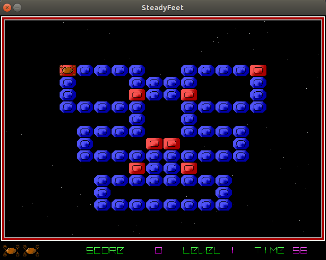
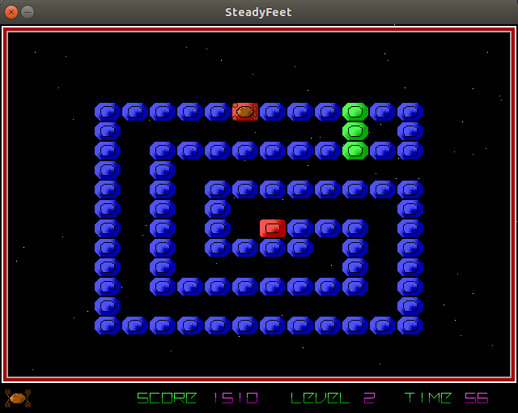

# Steadyfeet

C++ SDL implementation of the old MS-DOS [POD game](http://www.arkangles.com/pod/) by Swordsoft.

The goal of the game is to eat all the eatable tiles from the level, preferibly in the less ammount of time possible, to get more points.

I developed this a long time ago: there is no sound and some menus are missing, but otherwise it's fully playable.

## Screenshots

 

## Install

Just type "make" to compile it and "make install" to install it (optional).

(Also [available for MorphOS](https://www.morphos-storage.net/?find=SteadyFeet).)
